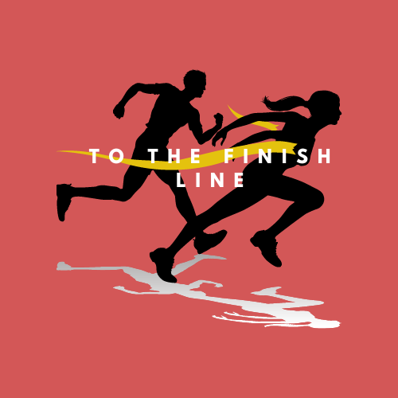
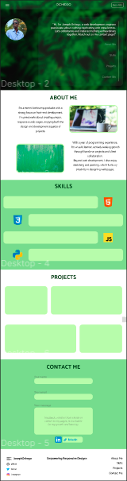
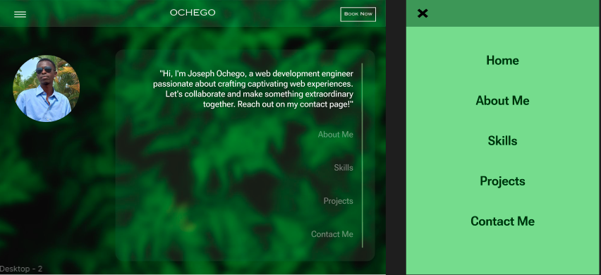

<!-- Capstone Project Overview -->
<!-- Todo  -->
<!-- * 
i) Project Overview
ii) Features & Functionality
iii) Technologies Used
iv) Screenshots or Demo
v) Roadmap & Future Enhancements
vi) Contact Info
 -->

# Capstone Project!🏁  
The *grand finale* project.  

# Project Description📖
As I come to the end of my ALX SE program, I am finishing it off with a ***capstone project*** where I will employ what I have learnt so far in terms of technologies, frameworks and tools.👨👨🏽‍💻  

# Index📇

## Overview  
- My capstone project is based on building my web development portfolio.  

- My implementation of the portfolio is aimed at giving prospective clients a feel of what I create and an insight into who I am, what kind of person they will possibly be working with.  

- Clients usually have a hard time deciding on the best person to work with since the internet is flooded with portfolios.  
I seek to make this easier by creating a portfolio that is as candid as possible, providing information about my experience, projects I have worked on and my inspirations and style.  

- After looking at my portfolio, I want the client to be sure of whether I am the right person for their job, not confused, not unsure, but convinced. This saves them time.  

## Features  
- My portfolio offers an easy to navigate layout.  
- My skills, projects and contact info are readily available for any interested clients or visitors.  
- The design is very friendly, displaying a lot of character using colors, shapes and interesting design choices.  

## Technologies Used  
- I have used some of the technologies I have learnt over the course of this program cumulatively to make this portfolio come alive.  
- These include:
    - HTML  
    - CSS  
    - JavaScript  
- For design and prototyping, I used <a href="www.figma.com">Figma</a> and <a href="draw.io">Draw.io</a>  

## Demo  
- Here are a few screenshots to demonstrate the design and fetures of my web portfolio:  
  
  

- I used pencil and paper to come up with the initial design, and then brought it to life in <a href="www.figma.com">Figma</a>.